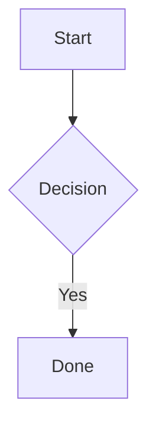

# Notes (Notlarım)

## Purpose

Obsidian-style note taking with wikilinks, tabs, Mermaid diagrams, and automatic RAG indexing.

## Features

- **TipTap editor** — headings, lists, bold, tables, math (KaTeX), text alignment
- **Wikilinks** — link to notes and course resources (files, web links)
- **Link picker** — `[[` autocomplete, toolbar `[[`, slash “Not / kaynak bağlantısı”, full search modal (large modal, scrollable list)
- **Ask agent** — slash `/Ajanta sor` or toolbar ✦; ephemeral in-note AI chat with note context, optional web research, copy or insert reply
- **Mermaid** — ` ```mermaid ` fenced blocks with in-editor SVG preview; `/` flowchart command
- **Tabs** — multiple notes open; persisted in `notes.tabs`
- **Backlinks** — notes that link to the current note (note-to-note only)
- **Export** — save single note as `.md` via save dialog
- **Course binding** — optional `courseId`; standalone notes have `courseId: null`

## Wikilink syntax

| Format | Example |
|--------|---------|
| Note (canonical) | `[[note:note_abc123\|Görünen metin]]` |
| Resource | `[[resource:res_xyz789\|PDF adı]]` |
| Legacy note title | `[[Not Başlığı]]` |
| Legacy note id | `[[note_abc123]]` |

### Click behaviour

| Target | Action |
|--------|--------|
| Note | Open in Notlarım tab |
| File resource | Open with system default app |
| Link resource | Open URL in browser |

## Mermaid

Insert via:

- Typing ` ```mermaid ` then Enter
- Slash command **Akış şeması**
- Toolbar diagram button

Edit source when the block is focused; blurred blocks render a preview. Markdown export keeps the fenced `mermaid` block for GitHub/Obsidian/RAG.

Basic syntax:



Directions: `TD`, `LR`, `RL`, `BT`. Shapes: `A[text]`, `B{text}`, `C((circle))`.

## RAG pipeline

On save (500 ms debounce):

```txt
TipTap JSON → contentMarkdown → knowledge-notes/{id}.md
```

Indexing runs **3 seconds** after the last edit (background, per note) so typing stays smooth.

## Chat integration

- **Save as note** from chat (includes thinking, research, answer)
- Chat can filter RAG by course

## IPC

- `notes:list`, `notes:create`, `notes:update`, `notes:delete`
- `notes:export-md`, `notes:resolve-link`, `notes:resolve-target`, `notes:backlinks`
- `notes:create-from-chat`
- `shell:open-resource` — open file/link resources from wikilinks
